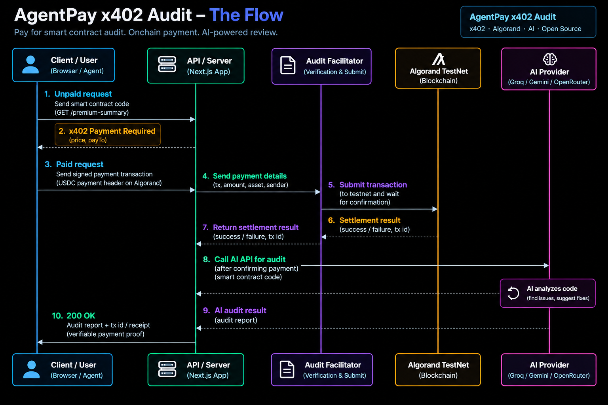

# AgentPay x402 Audit

> AI-powered smart contract security review with agent-managed payment verification on Algorand TestNet.

[](https://nextjs.org/)
[](https://developer.algorand.org/)
[](https://groq.com/)

## Overview

AgentPay x402 Audit is an experimental application that combines:

- AI-assisted smart contract security review
- Agent-managed blockchain payments
- Algorand TestNet payment verification
- Multi-provider AI fallback
- Real-time workflow updates

A user submits smart contract source code.

The backend executes a payment workflow, verifies the transaction on Algorand TestNet, and then sends the contract to an AI provider for security analysis.

## Live Demo

**Try the application:**

[https://agentpay-x402-audit.onrender.com/](https://agentpay-x402-audit.onrender.com/)

> The hosted demo depends on external AI providers and blockchain services. Free API tiers may occasionally experience rate limits, cold starts, or temporary availability issues.

If the hosted demo is temporarily unavailable, clone the repository and run it locally using your own environment variables.

## How It Works




## Screenshots

### Application Overview


### Completed AI Security Review


## Features

- AI-assisted smart contract review
- Automated payment transaction creation
- Algorand TestNet integration
- On-chain payment verification
- Multi-provider AI fallback
- Groq as the primary AI provider
- Gemini as a backup provider
- OpenRouter as a final fallback
- Server-Sent Events for live workflow updates
- Real-time audit progress
- Estimated AI review time
- Actual AI review duration
- Transaction explorer links
- Structured security findings

## Tech Stack

### Frontend

- Next.js
- React
- TypeScript
- CSS

### Backend

- Next.js Route Handlers
- Server-Sent Events

### Blockchain

- Algorand TestNet
- Algorand SDK
- AlgoNode API

### AI Providers

- Groq
- Google Gemini
- OpenRouter

## Run Locally

### 1. Clone the repository

```bash
git clone https://github.com/sreekanthrauth/agentpay-x402-audit.git
```

### 2. Enter the project

```bash
cd agentpay-x402-audit
```

### 3. Install dependencies

```bash
npm install
```

### 4. Create your environment file

Copy `.env.example` and rename the copy to:

```text
.env.local
```

Then add your API keys and Algorand configuration.

### 5. Start the development server

```bash
npm run dev
```

Open:

```text
http://localhost:3000
```

## Environment Variables

Create a `.env.local` file:

```env
# AI Providers
GROQ_API_KEY=
GEMINI_API_KEY=
OPENROUTER_API_KEY=

# Algorand TestNet agent wallet
AGENT_MNEMONIC=

# Payment recipient
MERCHANT_ADDRESS=

# Audit price in microAlgos
SERVICE_PRICE_MICROALGOS=100000
```

> Never commit your `.env.local` file, wallet mnemonic, private keys, or API keys.

## AI Provider Strategy

External AI providers can experience:

- Rate limits
- Temporary outages
- Model availability changes
- API quota limits

The application uses a sequential fallback strategy:

```text
Groq
 ↓ unavailable
Gemini
 ↓ unavailable
OpenRouter
```

This improves the availability of the AI review workflow.

The frontend shows which provider is currently handling the audit and displays provider switching when a fallback occurs.

## Real-Time Workflow Updates

The audit process contains multiple asynchronous steps:

```text
Request
   ↓
Signing
   ↓
Broadcasting
   ↓
Transaction Submitted
   ↓
Blockchain Confirmation
   ↓
Payment Verification
   ↓
AI Review
   ↓
Complete
```

The backend streams these updates to the frontend using Server-Sent Events instead of requiring the frontend to repeatedly poll for status updates.

## Payment Verification

Submitting a transaction alone is not treated as proof of payment.

The backend waits for blockchain confirmation and verifies the transaction details before starting the AI review.

The verification checks:

- Transaction confirmation
- Payment sender
- Payment receiver
- Payment amount

Only after successful verification does the AI audit workflow begin.

## Project Structure

```text
agentpay-x402-audit/
│
├── .env.example
├── .gitignore
├── README.md
├── package.json
├── package-lock.json
├── tsconfig.json
├── next.config.ts
├── next-env.d.ts
│
├── public/
│   └── screenshots/
│       ├── audit-workflow.png
│       └── security-review.png
│
└── src/
    └── app/
        ├── api/
        │   └── audit/
        │       └── route.ts
        │
        ├── globals.css
        ├── layout.tsx
        └── page.tsx
```

## Engineering Decisions

### Why multiple AI providers?

A single AI provider creates a dependency on one external service.

The application therefore uses:

```text
Primary Provider
      ↓ failure
Backup Provider
      ↓ failure
Final Fallback
```

This makes the audit workflow more resilient to temporary provider failures.

### Why Server-Sent Events?

The payment and AI review workflow takes multiple asynchronous steps.

Server-Sent Events allow the server to push progress updates directly to the frontend.

This provides a clearer user experience than repeatedly polling the server.

### Why verify payment on-chain?

The application does not consider broadcasting a transaction as successful payment.

It waits for confirmation and validates the relevant transaction details before continuing to the AI review.

## Important Security Notes

This project is an experimental demonstration.

The AI-generated review:

- Is not a professional smart contract audit
- Can miss vulnerabilities
- Can produce incorrect findings
- Should not be the only security review before deploying production contracts

AI API keys and wallet mnemonics must remain private.

Never commit:

```text
.env.local
Private keys
Wallet mnemonics
API keys
```

## Inspiration

This project explores agentic payment workflows and AI-assisted developer tooling.

The current implementation uses a direct Algorand TestNet payment and verification workflow.

## License

MIT